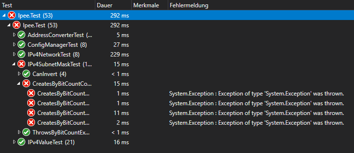
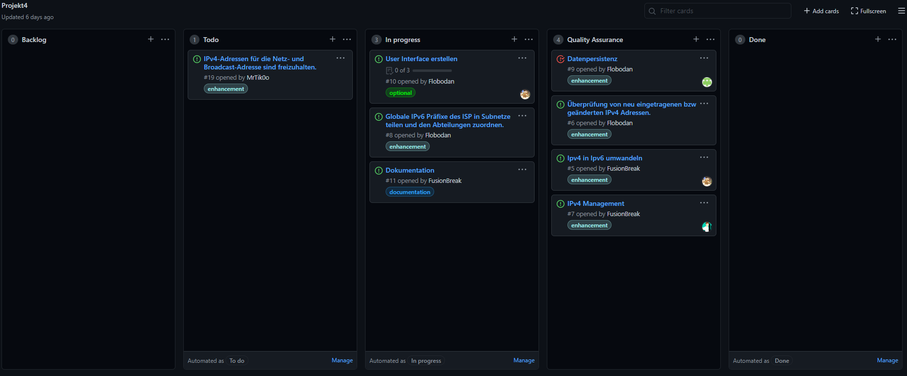
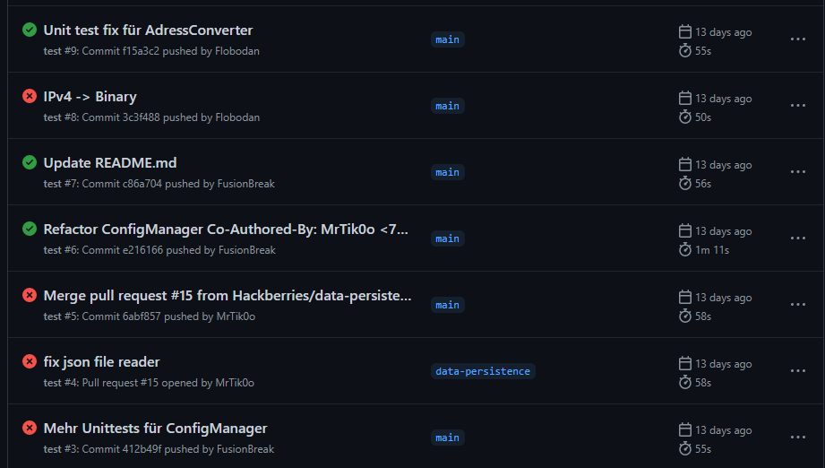

# Verwendete Technologien

## C# Kosmos

Um dieses Projekt in Maße unserer Vorstellungen und eigenen Ansprüchen umzusetzen, wurde auf eine Vielzahl an Technologien gesetzt. Als gewählte Programmiersprache kam gänzlich C# mit .NET 5 zum Einsatz. Damit einher ging auch die Wahl auf WPF (Windows Presentation Foundation), welches ein Framework zu Erstellung von nativen Benutzeroberflächen unter Windows darstellt.

Um möglichst auf eigene Leistungen zu setzen, wurden auf weitere Bibliotheken verzichtet. *.NET alleine bietet dafür schon viel zu viel* 😅

### XUnit

Damit wir im Falle von nachträglichen Codeanpassungen die Korrektheit unserer Funktionen garantieren können, haben wir von Anfang an auf den Einsatz von Unittests gesetzt, wofür das Framework XUnit zum Einsatz kommt. So war es uns möglich, nach jeder Codeanpassung einmal sämtliche Test durchlaufen zu lassen und ohne die Oberfläche starten zu müssen, Fehler zu finden.

## Github

Einen hohen Stellenwert in unserer Arbeit nahm die Versionscontrolle mittels Git ein. Als Host für unser Repository haben wir uns dann für Github entschieden, da es all unsere geforderten Features bietet und in unserem Team vertraut war. Doch diente Github uns weit mehr als nur für das eigentliche Repository - wir konnten eine ganze Pipeline darüber laufen lassen.

### Github-Projects

Mittels [Issues](https://github.com/Hackberries/Ipee/issues) und dem [Projekt](https://github.com/Hackberries/Ipee/projects/1) von Github konnten wir unsere Aufgaben darstellen, zuordnen und dokumentieren.

### Github-Actions

Über die sogenannten Actions von Github, haben wir uns einen Workflow eingerichtet, welcher nach jedem Commit auf dem Main-Branch konsequent ausgeführt wird. Dieser versucht den Sourcecode erst zu kompilieren und anschließend sämtliche Unittests darauf anzuwenden. Sollte es dabei zu einem Fehler kommen, würden wir als Entwickler automatisch informiert. Theoretisch wäre es auch möglich, darüber nach jeden Commit die statische Code-Doku-Seite aktualisieren zu lassen, jedoch scheiterte die Umsetzung bis zu Abgabe dieses Projekts an mangelndem Wissen darüber.

